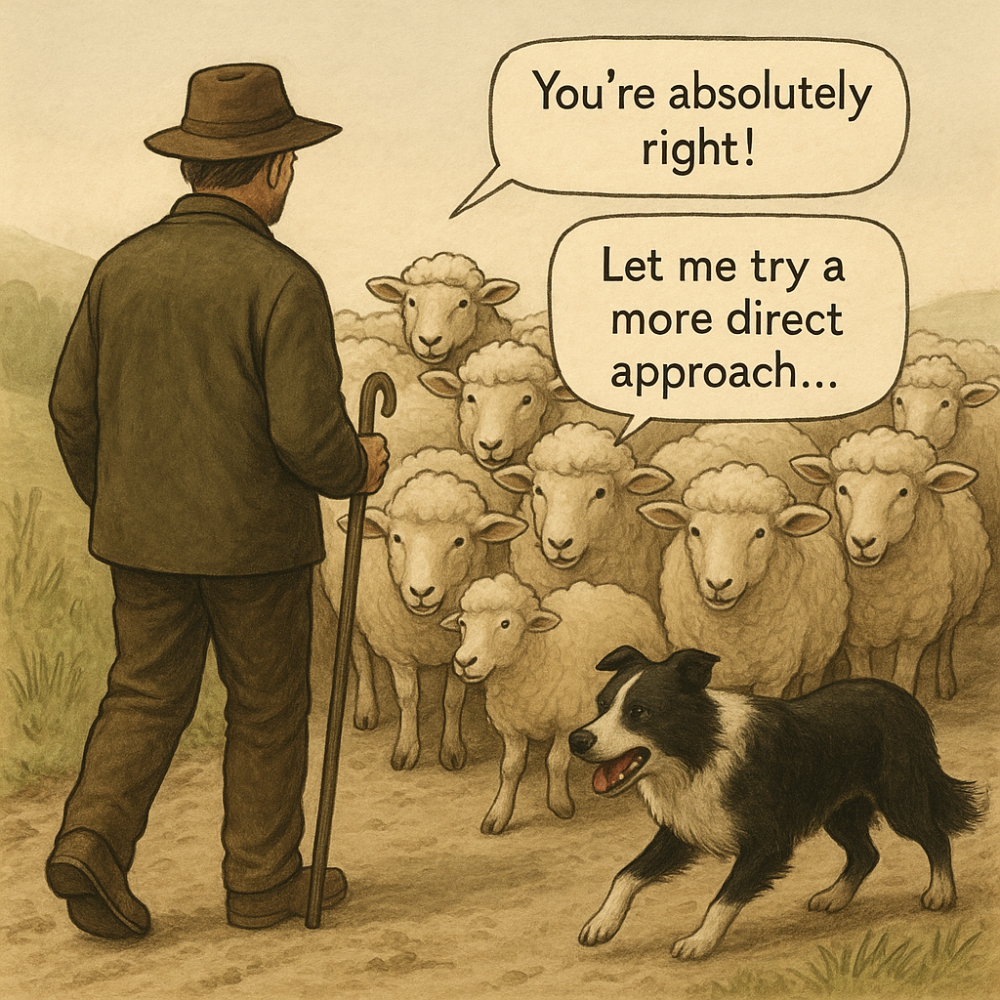

# 🐑 Claude Code Shepherd

A monitoring script that watches Claude Code conversations for rule violations and development issues using intelligent AI analysis.

## Features

- **Real-time monitoring** of Claude Code conversation logs
- **Custom rules** defined in `.shepherd/settings.json` 
- **Smart analysis** using Claude API calls to detect violations in reasoning and suggestions
- **Context-aware** tracking with configurable message windows
- **Violation tracking** to prevent duplicate alerts within context windows
- **Heartbeat status** showing monitoring activity and message counts
- **Multi-project support** with concurrent monitoring and async analysis
- **Structured alerts** with detailed reasoning and actionable suggestions
- **Color-coded output** for easy visual parsing of alerts
- **Real-time suggestion injection** via Claude Code hooks for immediate feedback
- **Detection-only mode** for monitoring without automated intervention

## Installation

1. Clone this repository
2. Ensure you have Python 3.7+ installed  
3. Configure your rules in `.shepherd/settings.json`
4. Ensure Claude Code is installed and configured

## Configuration

### Rules Configuration

Create `.shepherd/settings.json` with your monitoring rules:

```json
{
  "seed": "You are a software engineering supervisor monitoring a developer conversation.",
  "rules": {
    "git-add-all": "Using 'git add .' or 'git add -A' without reviewing changes first",
    "test-coverage": "Skipping tests or deploying code without running existing tests", 
    "temp-file": "Creating temporary files in project directories",
    "hardcoded-secrets": "Including API keys, passwords, or secrets directly in code",
    "no-error-handling": "Writing code without proper error handling or validation"
  }
}
```

### Multi-Project Configuration

For multi-project mode, create `.shepherd/projects.json`:

```json
{
  "projects": [
    "/path/to/project1",
    "/path/to/project2",
    "/path/to/project3"
  ]
}
```

## Usage

### Single Project Mode
```bash
python shepherd.py /path/to/project [-v] [-b 10] [-c 10] [--detect-only]
```

### Multi-Project Mode  
```bash
python shepherd.py [-v] [-b 10] [-c 10] [--detect-only]
```

**Command Line Options:**
- `-v` or `--verbose`: Enable detailed debug output
- `-b NUM` or `--heartbeat NUM`: Show heartbeat every NUM messages (default: 10, 0 to disable)
- `-c SIZE` or `--context SIZE`: Number of messages to include in analysis context (default: 10)
- `--detect-only`: Detection-only mode - skip hook installation and suggestion file creation

## How It Works

1. **Real-time Monitoring**: Watches Claude Code conversation logs for new messages
2. **Intelligent Analysis**: Uses Claude API to analyze assistant reasoning and suggestions
3. **Rule-based Detection**: Checks for violations against your custom development rules
4. **Context Tracking**: Maintains conversation context and tracks reported violations
5. **Async Processing**: Processes multiple projects concurrently with non-blocking analysis
6. **Smart Alerting**: Avoids duplicate alerts for violations still within context window
7. **Automatic Feedback**: By default, suggestions are automatically injected into Claude Code conversations via hooks for immediate guidance

## Operating Modes

### Default Mode (Full Integration)
- **Hook Installation**: Automatically installs UserPromptSubmit hooks in monitored projects
- **Real-time Injection**: Suggestions are injected directly into Claude Code prompts for immediate guidance
- **Suggestion Storage**: Creates `.shepherd/suggestions/<project-id>.md` files for hook consumption
- **How it works**: When violations are detected, shepherd writes suggestions to project-specific files. Claude Code's UserPromptSubmit hook reads these files and automatically prepends suggestions to user prompts before Claude processes them. The suggestion files are deleted after reading to prevent duplication.
- **Best for**: Active development with immediate feedback and guidance

### Detection-Only Mode (`--detect-only`)
- **No Hook Installation**: Skips installing Claude Code hooks
- **No File Creation**: Suggestions are only displayed in terminal, not stored for injection
- **Pure Monitoring**: Only detects and reports violations without automated intervention
- **Best for**: Code reviews, auditing, or environments where hook installation isn't desired

## Alert Output Format

When violations are detected, Shepherd provides structured, color-coded alerts:

```
/path/to/project: 🚨 rule-name
REASON: Detailed explanation of how the rule was violated and what the assistant did wrong.
SUGGESTION: Specific guidance for the assistant to fix the current issue and prevent similar mistakes.
========================================
```

**Color Coding:**
- **Red**: Project path and alert type
- **Orange**: Reason section explaining the violation  
- **Green**: Suggestion section with actionable guidance (when available)

## Advanced Features

### Violation Tracking
- Prevents duplicate alerts for the same violation within the context window
- Automatically cleans up old violations when they fall outside the context
- Tracks violations by message number for precise context management

### Multi-Project Monitoring
- Monitors multiple projects simultaneously with async Claude API calls
- Independent heartbeat tracking per project
- Concurrent analysis without blocking file monitoring
- Unified output with clear project identification

### Context Management
- Configurable context window size for analysis
- Smart context building with recent conversation history
- Rule-aware analysis that considers conversation flow

## Requirements

- Python 3.7+
- Claude Code installed and configured
- Access to Claude API via Claude Code
- Read access to Claude Code conversation logs

## Directory Structure

```
your-project/
├── .shepherd/
│   ├── settings.json      # Rules and configuration
│   └── projects.json      # Multi-project setup (optional)
└── shepherd.py            # Main monitoring script
```

## License

MIT License